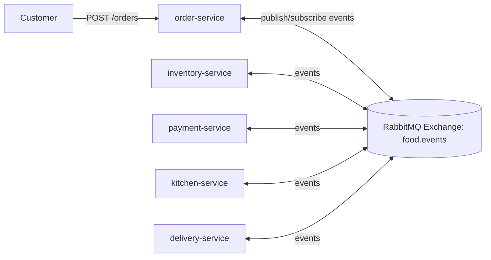
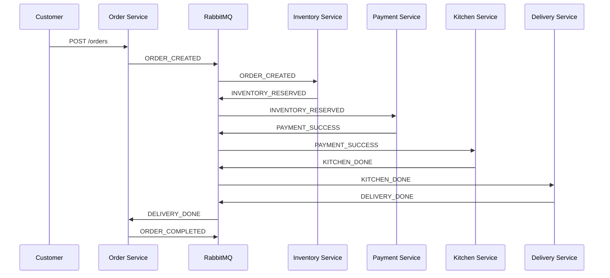
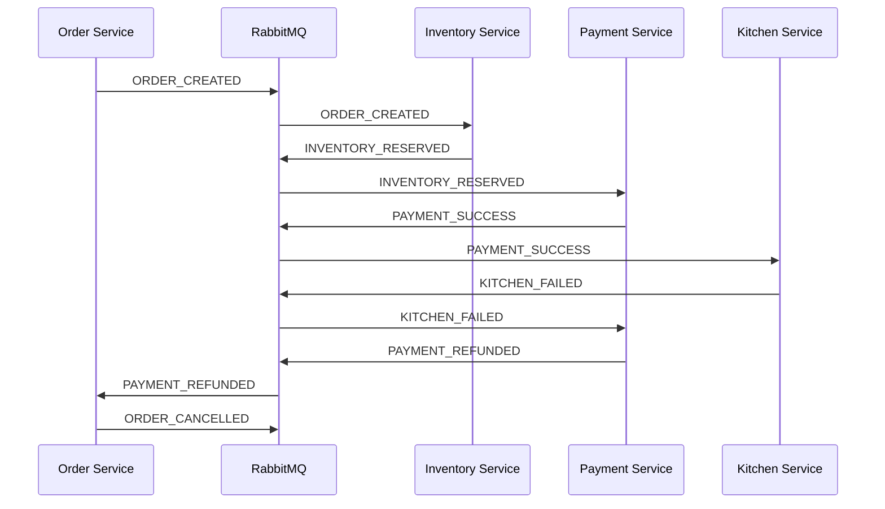

# Evidence - Event Choreography

## 1) Sơ đồ kiến trúc

## 2) Danh sách event / queue / topic

Exchange:

- `food.events` (topic)

Queues (mỗi service một queue riêng):

- `order-service.events`
- `inventory-service.events`
- `payment-service.events`
- `kitchen-service.events`
- `delivery-service.events`

Events:

- `ORDER_CREATED`
- `INVENTORY_RESERVED` / `INVENTORY_FAILED`
- `PAYMENT_SUCCESS` / `PAYMENT_FAILED`
- `KITCHEN_DONE` / `KITCHEN_FAILED`
- `PAYMENT_REFUNDED`
- `DELIVERY_DONE` / `DELIVERY_FAILED`
- `ORDER_COMPLETED` / `ORDER_CANCELLED`

## 3) Sequence - Luồng thành công

## 4) Sequence - Luồng lỗi (Kitchen fail -> Refund)

## 5) Tình huống failure + phản ứng

- Inventory fail: `INVENTORY_FAILED` -> `ORDER_CANCELLED`
- Payment fail: `PAYMENT_FAILED` -> `ORDER_CANCELLED`
- Kitchen fail: `KITCHEN_FAILED` -> `PAYMENT_REFUNDED` -> `ORDER_CANCELLED`
- Delivery fail: delivery service retry tối đa 3 lần, hết retry -> `DELIVERY_FAILED` -> `ORDER_CANCELLED`

## 6) Chứng minh choreography khác orchestration

- Không có service trung tâm điều phối.
- Mỗi service tự quyết định bước tiếp theo dựa trên event nó nghe được.
- Luồng nghiệp vụ phân tán qua các service.

## 7) Scaling

Có thể scale độc lập:

- `inventory-service`
- `payment-service`
- `kitchen-service`
- `delivery-service`
- `order-service`

Mỗi instance xử lý message từ queue theo cơ chế cân bằng của RabbitMQ.

## 8) Resilience

- Service crash không làm sập toàn bộ workflow ngay lập tức.
- Event-driven cho phép xử lý không đồng bộ.
- Delivery có retry 3 lần.
- RabbitMQ tách rời producer/consumer.

## 9) Ưu nhược điểm choreography

Ưu điểm:

- Decoupled cao.
- Scale ngang từng service tốt.
- Không có single orchestrator.

Nhược điểm:

- Debug trace khó hơn khi flow dài.
- Workflow logic bị phân tán, khó maintain khi nghiệp vụ tăng độ phức tạp.
- Observability cần đầu tư thêm (tracing/correlation).

## 10) Kết luận

Choreography phù hợp khi:

- Hệ thống cần scale mạnh theo service.
- Team quen event-driven và có năng lực observability.
- Workflow không quá phức tạp hoặc cho phép phân tán logic.
