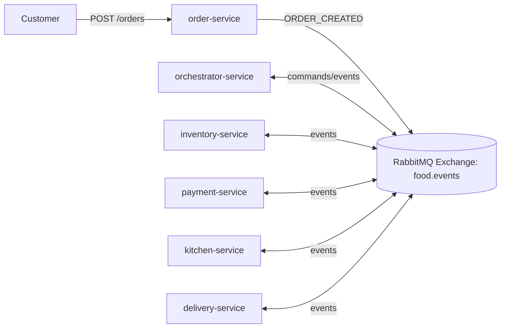
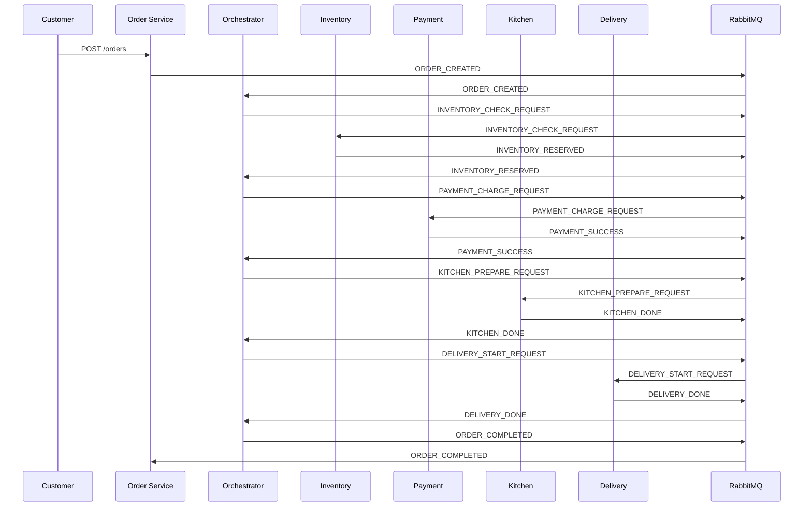
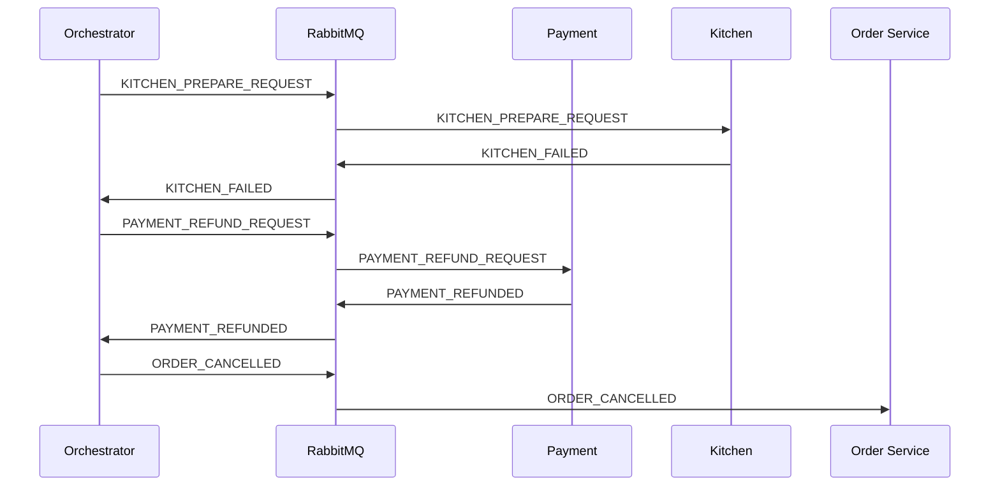

# Evidence - Event Orchestration

## 1) Sơ đồ kiến trúc

## 2) Danh sách event / queue / topic

Exchange:

- `food.events` (topic)

Queues:

- `order-service.events`
- `orchestrator-service.events`
- `inventory-service.events`
- `payment-service.events`
- `kitchen-service.events`
- `delivery-service.events`

Command events:

- `INVENTORY_CHECK_REQUEST`
- `PAYMENT_CHARGE_REQUEST`
- `KITCHEN_PREPARE_REQUEST`
- `DELIVERY_START_REQUEST`
- `PAYMENT_REFUND_REQUEST`

Result/domain events:

- `ORDER_CREATED`
- `INVENTORY_RESERVED` / `INVENTORY_FAILED`
- `PAYMENT_SUCCESS` / `PAYMENT_FAILED` / `PAYMENT_REFUNDED`
- `KITCHEN_DONE` / `KITCHEN_FAILED`
- `DELIVERY_DONE` / `DELIVERY_FAILED`
- `ORDER_COMPLETED` / `ORDER_CANCELLED`

## 3) Sequence - Luồng thành công

## 4) Sequence - Luồng lỗi (Kitchen fail -> Refund)

## 5) Tình huống failure + cách phản ứng

- Inventory fail: Orchestrator nhận `INVENTORY_FAILED` và phát `ORDER_CANCELLED`.
- Payment fail: Orchestrator nhận `PAYMENT_FAILED` và phát `ORDER_CANCELLED`.
- Kitchen fail: Orchestrator phát `PAYMENT_REFUND_REQUEST`, nhận `PAYMENT_REFUNDED`, sau đó `ORDER_CANCELLED`.
- Delivery fail: Orchestrator retry `DELIVERY_START_REQUEST` tối đa 3 lần, hết retry -> `ORDER_CANCELLED`.

## 6) Chứng minh orchestration khác choreography

- Có service trung tâm (`orchestrator-service`) nắm toàn bộ state machine của workflow.
- Service con không tự quyết bước tiếp theo, chỉ xử lý command và trả kết quả.
- Luồng nghiệp vụ tập trung, dễ quản lý thay đổi theo business flow.

## 7) Scaling

Scale độc lập được:

- `inventory-service`, `payment-service`, `kitchen-service`, `delivery-service`, `order-service`.
- `orchestrator-service` cũng scale được nhưng cần quản lý state/chia partition theo `orderId` nếu mở rộng lớn.

## 8) Resilience

- Retry delivery được quản lý tập trung trong orchestrator.
- Có thể bổ sung dead-letter queue, timeout, circuit-breaker để mở rộng resilience.
- Điểm cần lưu ý: orchestrator là thành phần quan trọng, cần chạy nhiều replica và monitor.

## 9) So sánh bắt buộc giữa 2 mô hình

### Event Choreography

Ưu điểm:

- Decoupling cao.
- Scale linh hoạt theo từng bounded context.
- Không phụ thuộc một bộ điều phối duy nhất.

Nhược điểm:

- Debug phức tạp hơn (trace event qua nhiều service).
- Khó maintain khi workflow dài và nhiều nhánh.
- Observability cần kỷ luật đặt tên event + correlationId + tracing.

Độ phức tạp debug:

- Cao hơn orchestration do logic phân tán.

Khả năng mở rộng:

- Rất tốt theo service-level scaling.

Coupling:

- Coupling thấp theo command trung tâm, nhưng coupling vào hợp đồng event.

Observability:

- Cần đầu tư mạnh vào distributed tracing và log tập trung.

### Event Orchestration

Ưu điểm:

- Workflow dễ hiểu, dễ theo dõi, dễ thay đổi.
- Debug, audit, compliance dễ hơn vì có điểm điều phối rõ ràng.
- Retry/compensation tập trung (ví dụ refund, delivery retry).

Nhược điểm:

- Nguy cơ bottleneck nếu orchestrator thiết kế kém.
- Tăng coupling vào orchestrator và protocol command/result.

Single point of failure?

- Có thể trở thành SPOF nếu chỉ 1 instance.
- Giảm rủi ro bằng replica + healthcheck + queue durability + idempotency.

Coupling vao orchestrator:

- Có, vì tất cả bước nghiệp vụ phụ thuộc state machine của orchestrator.

De maintain workflow:

- Tốt hơn choreography trong bài toán workflow phức tạp, nhiều nhánh compensation.

## 10) Kết luận chọn mô hình

Khi nào chọn choreography:

- Team ưu tiên autonomy của service.
- Workflow đơn giản đến trung bình.
- Mục tiêu scale ngang rất cao, ít thay đổi luồng nghiệp vụ trung tâm.

Khi nào chọn orchestration:

- Workflow dài, nhiều nhánh fail/compensation.
- Cần quan sát, audit, và maintain workflow dễ dàng.
- Cần retry/coordinator tập trung theo rule nghiệp vụ.

Trong hệ thống đặt đồ ăn nếu ưu tiên scaling + resilience:

- Lựa chọn cân bằng là orchestration cho workflow đặt đơn vì dễ kiểm soát failure/retry/refund.
- Vẫn giữ event-driven và scale service độc lập.
- Nếu hệ thống cực lớn và team mạnh về event tracing, choreography có thể tối ưu về autonomy.
